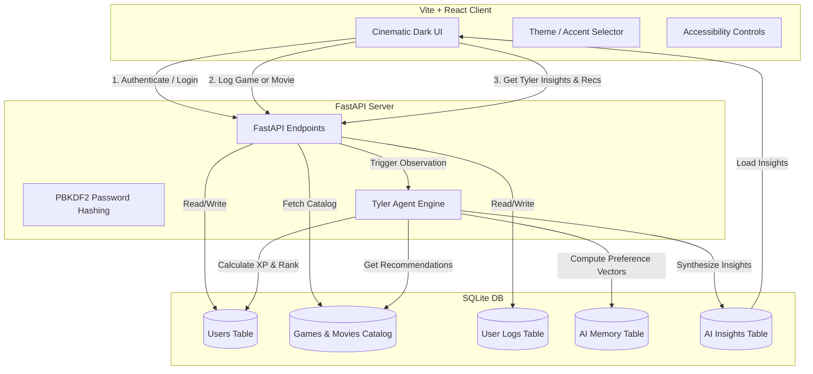

# leesure! 🎬🎮

**leesure!** is a premium, AI-powered entertainment tracker and curator. It is designed to catalog the games you play and the films you watch while a silent AI companion named **Tyler** quietly observes your choices, learns your aesthetic taste, tracks your progression, and delivers custom recommendations with natural language reasoning.

---

## 🏗️ System Architecture

The following diagram illustrates how the frontend, backend, SQLite database, and the Tyler Agent interact:



---

## 🔄 Taste Profiling & Progression Workflow

When you log an entry, **Tyler** updates your cognitive profile and computes your tracker ranking:

```mermaid
sequenceDiagram
    autonumber
    actor User as User
    participant UI as React UI
    participant API as FastAPI Backend
    participant Tyler as Tyler Agent Engine
    participant DB as SQLite Database

    User->>UI: Logs a completed Game/Movie (with rating & review)
    UI->>API: POST /api/user/{type}/{user_id}
    API->>DB: Save/Update user log entry
    
    rect rgb(30, 20, 40)
        Note over API, Tyler: Silent AI Observation Cycle
        API->>Tyler: update_user_profile(user_id)
        Tyler->>DB: Fetch all user logs
        Tyler->>Tyler: Recalculate weights for developers, directors, cinematographers, mechanics
        Tyler->>DB: Save updated profile JSON to AI Memory
    end

    rect rgb(20, 30, 40)
        Note over API, Tyler: Progression & Insights Calculation
        API->>Tyler: generate_weekly_insights(user_id)
        Tyler->>Tyler: Award XP (+100 per log, +10 per hour played)
        Tyler->>Tyler: Update Rank based on total logs
        Tyler->>DB: Update User Rank & XP
        Tyler->>DB: Write weekly insights text
    end

    API-->>UI: Return Success Response
    UI->>API: GET /api/tyler/insights/{user_id}
    API-->>UI: Load recommendations & weekly insights
    UI-->>User: Render Tyler Widget & Custom Recommendations
```



---

## ✨ Features

- **Dual-Tracker Dashboard**:
  - **Games**: Log status (`wishlist`, `playing`, `completed`), rating (1-10), hours played, completion percentage, and select favorite gameplay mechanics.
  - **Movies**: Log status (`watchlist`, `watched`), rating (1-10), and custom review.
- **Tyler's Cognitive Profile Engine**:
  - Dynamically weights your preferences based on developers, directors, cinematographers, music composers, studios, and genres.
  - Identifies patterns in your taste (e.g. tracking your average movie pacing, favorite gameplay mechanics, or preference for challenging difficulty).
- **Gamified Progression Ladder**:
  - Earn **XP** for every log and hour played.
  - Climb the ranks: `Observer` ➔ `Explorer` ➔ `Collector` ➔ `Completionist` ➔ `Curator` ➔ `Archivist` ➔ `Legend`.
  - Unlock cosmetic themes.
- **Aesthetic Cinematic Dark UI**:
  - Glassmorphic panels with customizable glowing accents (Violet, Amber, Cyan, Rose).
  - Accessibility settings: adjustable font sizes and reduced motion support.

---

## 🚀 Setup & Run Guide

### Prerequisites
- **Python 3.10+**
- **Node.js 18+**
- **Git**

### Installation

1. **Clone and Navigate to the Repository**:
   ```bash
   git clone <your-repository-url>
   cd CINEMATRACKER
   ```

2. **Setup Backend**:
   ```bash
   cd backend
   # Create a virtual environment
   python -m venv venv
   # Activate virtual environment
   # On Windows:
   venv\Scripts\activate
   # On macOS/Linux:
   source venv/bin/activate

   # Install dependencies
   pip install fastapi uvicorn sqlalchemy
   ```

3. **Setup Frontend**:
   ```bash
   cd ../frontend
   # Install dependencies
   npm install
   ```

---

## ⚡ Running the App

### The Quick Way (Windows)
Double-click or run the startup PowerShell script in the root directory:
```powershell
./start.ps1
```
This script starts both the FastAPI backend (port `8000`) and the Vite React frontend (port `5173`) in separate windows.

### The Manual Way

#### 1. Start the Backend
```bash
cd backend
venv\Scripts\activate
python -m uvicorn main:app --host 127.0.0.1 --port 8000 --reload
```

#### 2. Start the Frontend
```bash
cd frontend
npm run dev
```

Open **[http://localhost:5173](http://localhost:5173)** in your browser.
*Log in with the demo account: Username `demo` / Password `tyler`.*

---

## 🧠 Optional: Unlock LLM-Powered Insights

By default, Tyler uses a local, high-performance rule-based semantic parser. To unlock fully generative, conversational Tyler insights and recommendations, configure your API keys:

1. Create a file named `.env` in the `backend/` directory.
2. Add your Gemini or OpenAI API Key:
   ```env
   GEMINI_API_KEY=your_gemini_api_key_here
   # OR
   OPENAI_API_KEY=your_openai_api_key_here
   ```
3. Restart the backend. Tyler will automatically transition to the LLM agent model.
